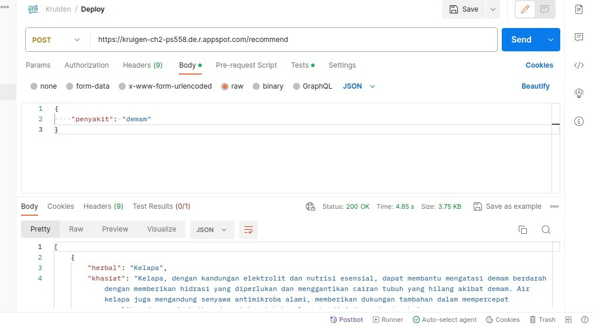

## Library
```python
pip install Flask pandas scikit-learn
```

## Run API
```bash
python main.py
```

## Access API by Postman
- Install postman-agent in system
- `127.0.0.1:5000/recommend`
- Add body > Raw > JSON
- `{"penyakit": "demam"}`
- 